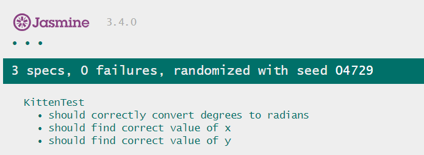

# QA-KittenCreator
Client side JavaScript testing with Jasmine 

# Live Demo
Hosted demo app: [Proj Demo](https://tianyoudai.github.io/QA-KittenCreator/jasmine/runner.html)

Run the tests here and view the results: [Testing Demo](https://tianyoudai.github.io/QA-KittenCreator/jasmine/runner.html)

# How the demo app work
When you visit the link above, JS is used to draw a cat to an html 5 canvas.

# How testing works
When the test link above is visited various tests are run locally aganist the code in the demo app. Show below is the Jasmine output when the test runs successfully.

# Technologies Used
The demo app is written in vanilla JS, HTML 5 and CSS 3. Client-side Jasmine is used to run the tests.

# Future Development
I would like to have the tests automatically run when a commit is made to the repo, and the site would automatically deploy to production if the tests pass successfully.
